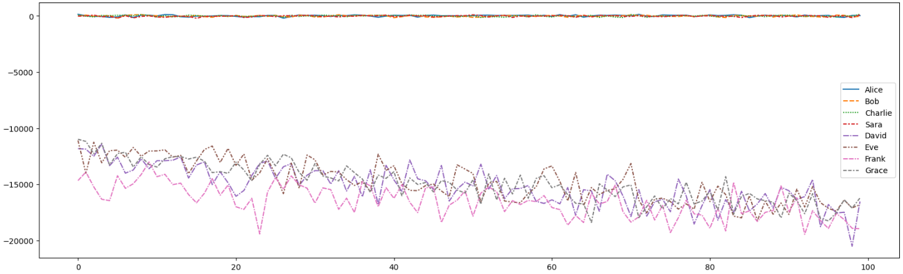
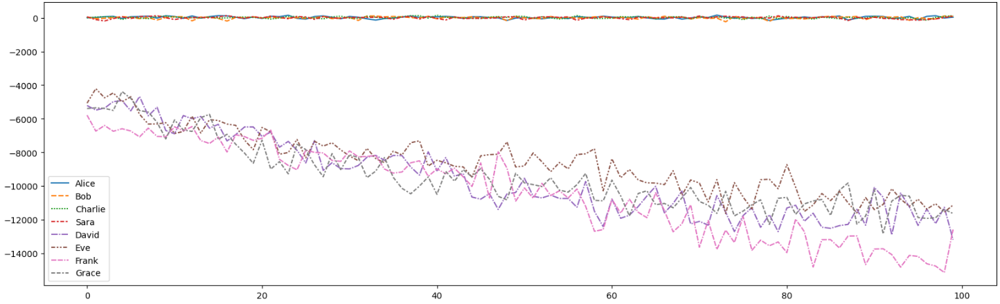

# Skull-King-Simulator ou Pourquoi le petit poisson c'est nul ou encore Pourquoi les game designers existent

L'objectif de ce repo est de montrer que le petit poisson détruit tellement le jeu du Skull King, que le fait de dire un nombre aléatoire de plis revient au même que de jouer "intelligemment" si cette carte se retrouve dans le Deck. Plus particulièrement, il empêche d'avoir une stratégie cohérente quand il s'agit de prédire les plis. (spoiler j'ai tort)

## Joueurs :

### SmartPlayer :

Un SmartPlayer est un joueur qui va chercher à gagner le pli quand il doit faire des plis et à chercher à perdre le pli quand il a déjà fait ses plis. Un SmartPlayer prédit un nombre de plis équivalent au nombre de cartes fortes dans sa main (cartes spéciales + carte ≥ 11).

### RandomTrickPlayer :

Un RandomTrickPlayer est un joueur qui va chercher à gagner le pli quand il doit faire des plis et à chercher à perdre le pli quand il a déjà fait ses plis. Un RandomTrickPlayer prédit un nombre aléatoire (entre 0 et le nombre de cartes dans sa main) de plis.

## Résultats obtenus

On simule 1000 parties à 8 joueurs et 8 rounds par parties avec et sans le petit poisson. Alice, Bob, Charlie et Sara sont des SmartPlayer, les autres sont des RandomTrickPlayer

Sans le Petit Poisson:

Avec le Petit Poisson:

Peut etre petit poisson meilleur carte du jeu 🤔

